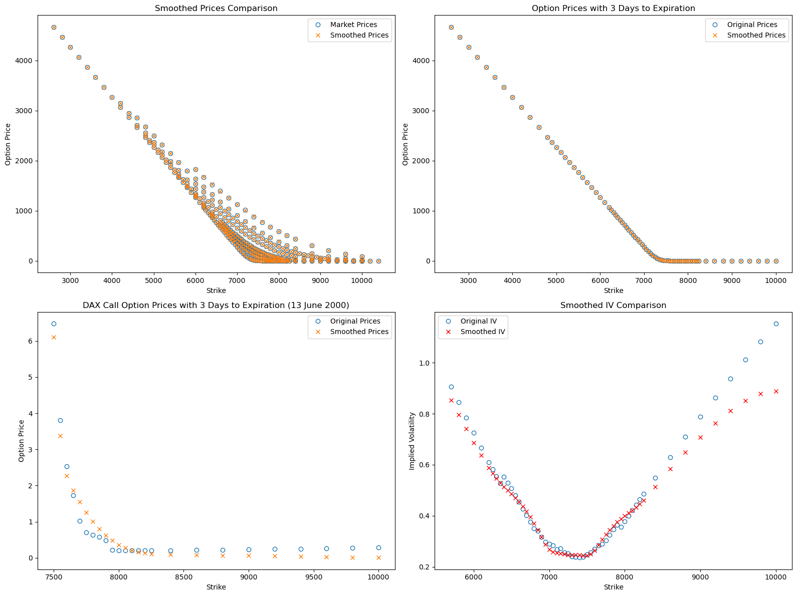
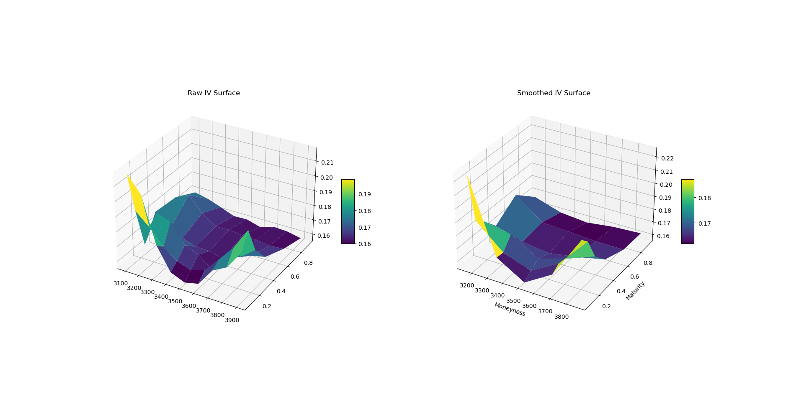
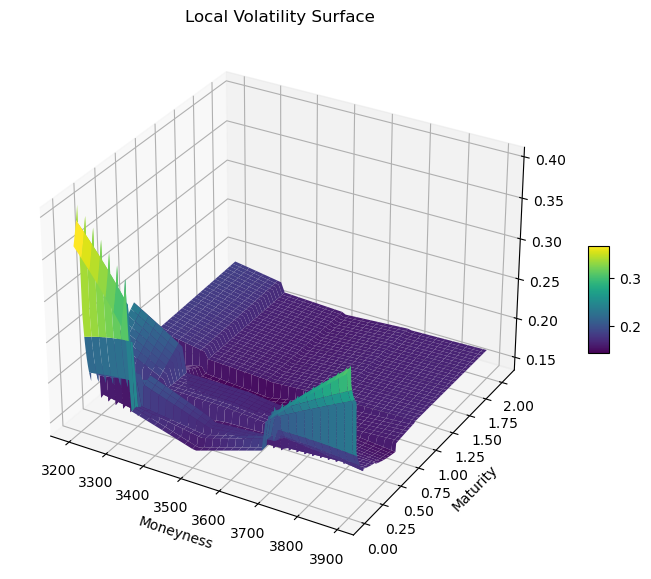

# 基于局域波动率模型的蒙特卡洛模拟定价：以雪球期权为例

## 理论背景

Black-Scholes模型中假设的波动率对所有的行权价和到期日都是恒定的，通过场内期权的市场价格可以反算得出基于Black-Scholes模型的隐含波动率。在实际观测中，隐含波动率依赖于行权价和到期日，会形成一个所谓的“隐含波动率曲面”。为了解释这一现象，Dupire (1994) 提出了一种从市场上观察到的期权价格推导出局域波动率函数的方法。局域波动率模型假设标的资产遵循扩散过程，并且资产的波动性是资产价格和时间的函数：

$$
d S_t = \mu S_tdt + \sigma_{L}(S_t, t)S_tdW_t
$$

其中，

- $S_t$ 是标的资产价格
- $\mu$ 是漂移项
- $W_t$是布朗运动项
- $\sigma_{L}$是随时间和标的资产价格变化的Dupire局域波动率

虽然局域波动率模型的提出者当时并未考虑到随机波动率模型，但是局域波动率模型是随机波动率模型中的一个特殊分支，也是最简单的市场模型 (Bergomi, 2016)。局部波动率模型可以分为两类：一类是无参化的模型，即并未给出具体形式的波动率函数关系; 而另一类是给定局域波动率的表达形式，例如著名的CEV模型（在先前讨论SABR波动率模型曲面中有相应的介绍，[原文链接](https://voladocs.readthedocs.io/zh/latest/volatility_model/sabr/sabr.html#cev)）。

Dupire (1994)，Derman and Kani (1994) ，Rubinstein(1994) 提出的局域波动率模型具有一个无参化（non-parametric）的表达形式，即假设 $\sigma_{L}(S_t, t)$有一定的函数关系，但并没有具体的函数表达式，通过市场数据隐含推导得出。通过观测的期权市场数据，存在唯一的、能使模型的期权价值与市场价格保持一致的局域波动率函数，该局域波动率函数 (Dupire’s Equation) 表达形式如下：

$$
\sigma_{L}^2(K, T, S_0) = \frac{\frac{\partial C}{\partial T}}{0.5K^2\frac{\partial^2{C}}{\partial K^2}} \\
$$
其中，$C$ 为 $C(F_T,K,T)$。

## 局域波动率模型定价步骤

上图展示了采用局域波动率模型定价的基本步骤：首先，采用Frengler (2009)的平滑方法对市场数据进行处理，避免由于套利机会而出现的负 $\sigma_{L}^2$。随后，通过Gatheral和Lynch (2004)的计算公式计算得出局域波动率曲面。最后，针对每一个离散观察的点，对相应的局域波动率曲线进行插值得到模拟过程中对应的局域波动率 $\sigma(S, t), t\in[t0, t1, .., T]$。通过蒙特卡洛模拟，计算得出相应期权结构的现值及其希腊值。

### 无套利光滑隐含波动率曲面

然而，局域波动率的正确定价需要一个无套利的隐含波动率曲面。若曲面存在套利机会，可能会导致计算出的转换概率为负 (Frengler, 2009)。为了解决这一问题，采用Frengler (2009)提出的无套利隐含波动率曲面平滑方法，该方法计算成本低廉，能够快速拟合出无套利隐含波动率曲面。

Frengler (2009) 采用的为2000年6月13日的DAX看涨期权隐含波动率数据，原文献复现结果如下：

为了更贴合国内市场行情，采用场内金融期权隐含波动率曲面计算相应的局域波动率，通过Frengler方法计算的2023年10月25日沪深300股指期权的隐含波动率曲面拟合结果如下：

### 局域波动率曲面

通过平滑后的无套利隐含波动率曲面，进而能够计算相应的局域波动率。采用市场隐含波动率计算局域波动率的公式如下（Gatheral and Lynch, 2004）:

$$
v_L = \frac{\frac{\partial w}{\partial T}}{1- \frac{y}{w} \frac{\partial w}{\partial y} + \frac{1}{4}(-\frac{1}{4} - \frac{1}{w}+ \frac{y^2}{w^2})(\frac{\partial w}{\partial y})^2 + \frac{1}{2} \frac{\partial^2 w}{\partial y^2}}
$$

其中，

- $w(S_0, K, T) = \sigma_{BS}^2(S_0, K, T)T$
- $y = \ln(\frac{K}{F_T})$

根据期权存续期限，计算每一个交易日所对应的局域波动率曲面。以500个交易日，年交易日天数为244天为例，拟合后的局域波动率曲面如下:

## 标准雪球定价

| **雪球测试条款** |                                                              |
| ------------------ | ------------------------------------------------------------ |
| 开始日期           | 2021年10月13日                                               |
| 结束日期           | 2022年10月13日                                               |
| 初始价格           | 100.0                                                        |
| 敲出方向           | 向上敲出向下敲入，**UP_OUT_DOWN_IN**                         |
| 敲出观察日         | 2021-11-15, 2021-12-13, 2022-01-13, 2022-02-14,  2022-03-14, 2018-04-13, 2022-05-13, 2022-06-13,  2022-07-13, 2022-08-15, 2022-09-13, 2022-10-13 |
| 敲出障碍价格       | 103.0                                                        |
| 敲出票息           | 年化 15%                                                     |
| 红利票息           | 年化 18%                                                     |
| 敲入观察频率       | 按日观察                                                     |
| 敲入障碍价格       | 80.0                                                         |
| 敲入赔付           | -PUT，行权价100%                                             |
| 票息计息规则       | 30/360                                                       |
| 日历               | A股交易日历                                                  |

### Black-Scholes 定价参数

| Spot  | r    | b    | vol  |
| ----- | ---- | ---- | ---- |
| 100.0 | 0.02 | 0.0  | 0.2  |

### 定价结果比较
|  | Black-Scholes模型 | 局域波动率 –Euler离散 | 局域波动率 –Milstein离散 |
| ------------------------ | ------------ | ------------ | ------------ |
| PV                       | 0.124199 | -0.663596  | -0.820962       |
| DELTA                    | 0.274492 | 0.423378 | 0.420788 |
| GAMMA                    | -0.0555351 | -0.0827226 | -0.0722836     |
| THETA                    | 16.6295 | 11.3222 | 11.8514           |
| VEGA                     | -57.9549 | -47.5611 | -46.8632 |
| RHO                      | 31.1487 | 29.9097      | 28.6283            |

## 总结

本文研究探讨了基于局域波动率曲面的蒙特卡洛模拟定价方法，局域波动率模型可以更精确地拟合市场上观察到的期权价格。通过使用 Dupire 公式以及市场上的隐含波动率数据，引入无套利约束条件，进而能够从市场价格中提取局域波动率，并应用在场外期权的定价中。虽然局域波动率模型在捕捉市场微观结构和动态变化具有一定的优势，但在对冲实践中仍存在一些问题。由于隐含波动率是从市场价格中反算得出，采用该方法定价在不同的市场情况中可能表现出不稳定性，从而导致对冲结果不精确。

## 参考文献

[1] Bergomi, L. (2015). Stochastic Volatility Modeling (1st ed.). Chapman and Hall/CRC. https://doi.org/10.1201/b19649.

[2] Derman, E. and I. Kani (1994). Riding On A Smile, RISK, 7 (February), 32-39.

[3] Dupire, B. "Pricing with a Smile." *Risk.* Vol. 7, Number 1, 1994, pp. 18–20.

[4] Gatheral, J. and Lynch, M. (2004) ‘Lecture 1: Stochastic Volatility and Local Volatility’.

[5] Fengler, M. (2009) ‘Arbitrage-free smoothing of the implied volatility surface’, *Quantitative Finance*, 9, pp. 417–428. doi: 10.1080/14697680802595585.

[6] Rubinstein, M. (1994). Implied Binomial Trees, *The Journal of Finance*, 49 (July), 771-818.

