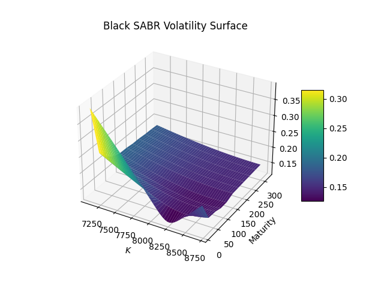

# SABR随机波动率模型：市场隐含波动率微笑

## 概述

随着金融市场的发展，传统的BSM模型对于刻画金融资产价格变动过程变得不够精确，难以解释金融市场中的复杂现象。通过反算场内期权市场价格的隐含波动率，不难发现隐含波动率并不是一个常数值，与BSM模型的假设相悖。市场上观察到的隐含波动率曲线通常会呈现“微笑”形状，即隐含波动率随着行权价格的变动进行非线性变动。在这种情况下，关于波动率模型通常有两类改进方法：一类是局部波动率模型，即对隐含波动率直接进行建模，假设资产的波动率是资产价格和剩余期限的确定函数; 另一类是随机波动率模型，即通过一条随机过程描述波动率的变化。

在实践中发现，Dupire（1994）局部波动率模型难以达到预期的效果。核心问题在于当标的资产价格上涨或下跌时，理论上波动率微笑曲线应分别向右或向左整体移动，然而局部波动率模型却呈相反方向变动 (Hagan, 2002) 。因此，该类模型在动态对冲方面的实际表现甚至不如BSM模型。本文将阐述基于SABR (Stochastic, $\alpha$, $\beta$, $\rho$)模型的波动率拟合方法，包括**直接拟合参数方法**，以及通过平值（at-the-money）波动率确定Alpha的间接拟合方法（下文简称为**Alpha间接调参法**）。

### 模型回顾：CEV模型

随着外汇市场的发展，以及随机波动模型的推广，一个更为广义的BS模型开始推广流行，该模型为CEV（Constant Elasticity of Variance Model）模型，又被称为固定方差模型，试图捕捉随机波动率及其杠杆效应，由Cox（1975）提出。CEV模型描述的是资产价格 $S_t$ 和其波动率 $ \sigma $ 之间的关系：

$$
\begin{equation}
	dS_t = rS_t dt + \sigma S_t^{\alpha} dW_t 
\end{equation}
$$

其中， $\alpha$ 是弹性系数，它决定了波动率如何随着资产价格的变动而变化。当 $\alpha = 1 $ 时，该模型即为最常见的几何布朗运动模型。CEV模型可以描述波动率与资产价格的关系，但它不考虑波动率本身的随机性。CEV动态过程通常被用于Libor市场模型中的skew建模（Andersen and Andreasen, 2000）。

### SABR模型

SABR（Stochastic, $\alpha$, $\beta$, $\rho$）模型是一个在金融工程中广泛使用的随机波动率模型，可以用来捕捉市场中的隐含波动率微笑。SABR模型在上述CEV模型的基础上加入了波动率的随机性，将资产的远期价格 $F_t$ 以及波动率 $\alpha$ 作为单独的随机过程，$\beta$ 在SABR模型中扮演与CEV模型中 $\alpha$ 类似的角色，两组随机过程与相关性 $\rho$ 相关：

$$
\begin{equation}
\begin{aligned}
	d\hat{F} &= \hat{\alpha} \hat{F}^{\beta} dW_1,  \hspace{5 mm} \hat{F}(0) = f \\
	d\hat{\alpha} &= v \hat{\alpha} dW_2, \hspace{5 mm} \hat{\alpha}(0) = \alpha\\
	dW_1dW_2 &=\rho dt
	
	
\end{aligned}
\end{equation}
$$

其中，

- $\hat{F}$ 为挂钩标的远期价格 （变量），其中 $f$挂钩标的当前远期价格 （常数）
- $\hat{\alpha} \in (0, +\infty)$，为SABR波动率 （变量）， 其中$\alpha$当前SABR波动率 （常数）
- $\beta \in [0, 1]$， 为SABR模型中的CEV指数，生成资产价格的分布，从正态（$\beta = 0$）到对数正态（$\beta = 1$）分布。
- $v \in (0, +\infty)$， 为波动率的波动 （volatility of volatility）

- $W_{1,t}$ 和 $ W_{2,t}$ 是两组Wiener过程，它们之间的相关性为$\rho$。

  

从形式上看，当在CEV模型中引入波动率 $\sigma$  的随机动态，即可推出SABR模型。简而言之，SABR是CEV模型的一种扩展形式，它不仅描述了资产价格的随机动态，还描述了波动率的随机动态。虽然CEV模型能够描述波动率与资产价格之间的某种确定性关系，但是在实际市场中，波动率本身通常为随机性。而SABR模型可以看作是CEV模型的自然衍生，通过增加波动率的随机性捕捉更多的市场现象。

## SABR模型计算方法

SABR模型本质上为波动率微笑模型，该模型天然无套利，不需要像其他随机波动率模型（如SVI模型，插入上一篇文章链接）一样新增额外的约束条件。值得注意的是，自2014年欧洲央行宣布负利率以来，负利率在国际市场上颇为流行，以下讨论的SABR模型通过相应调整也支持负利率的计算。

### Black SABR

在实际运用中通常假设标的资产遵循几何布朗运动。因此，假设$\beta = 1.0$。根据Hagan (2002)，$\beta$ 为1时，Black SABR模型隐含波动率公式可简化为：

$$
\begin{equation}
\begin{aligned}
	\sigma_{black} &= \alpha(\frac{z}{x(z)})[1 + (\frac{1}{4}\rho\alpha v + \frac{(2- 3\rho^2)v^2}{24})T + ...] \\
	x(z) &= \ln(\frac{\sqrt{1 - 2\rho z + z^2} + z - \rho}{1 - \rho}) \\
	z &= \frac{v}{\alpha}\ln\frac{F}{K} \\
	
\end{aligned}
\end{equation}
$$

其中，F为当前远期价格，K为期权行权价。

### Bachelier(Normal) SABR

Hagan (2002)也提出了基于正态分布SABR模型的隐含波动率计算方法，若要使用Bachelier SABR模型，将$\beta$设置为0，简化为：

$$
\begin{equation}
\begin{aligned}
	\sigma_{bachelier} &= v(\frac{F - K}{x(z)})[1  + \frac{(2- 3\rho^2)v^2}{24}T + ...]
\end{aligned}
\end{equation}
$$

## SABR模型校正

通过Black76模型计算出2023年7月26日聚乙烯期权的隐含波动率，作为市场波动率观测值输入值SABR模型拟合波动率曲面中，进行非线性最小二乘校准参数并寻找全局最有解。在模型校正实践中，不难发现，参数校准值在一定程度上也依赖于初始值的设定，假设的波动率初始值由当前市场波动率的Cubic Spline插值产生。

### 直接拟合参数方法

根据2.1节，固定 $\beta = 1.0$，直接对$\alpha$ ，$\rho$，$v$ 进行拟合，最小化市场波动率与SABR模型计算的隐含波动率之间的平方误差。

### Alpha间接调参法

根据2.1节，固定 $\beta = 1.0$，直接对$\rho$，$v$ 进行拟合。$\alpha$ 参数则是通过市场平价(ATM)波动率进行校准，假设ATM平价波动率为 $\sigma_{atm}$, West (2005a)表明 $\alpha$为三次方程的平方根。

Black SABR关于 $\alpha$的三次方程如下：
$$
\begin{equation}
	\frac{(1-\beta)^2T}{24F^{2-2\beta}}a^3 + \frac{\rho\beta v T}{4F^{1-\beta}}a^2 + (1 + \frac{2 - 3\rho^2}{24} v^2 T)\alpha - \sigma_{black,atm}F^{1-\beta} = 0
\end{equation}
$$

Normal SABR关于 $\alpha$的三次方程如下：
$$
\begin{equation}
	\frac{\beta(\beta - 2)T}{24F^{2-2\beta}}a^3 + \frac{\rho\beta v T}{4F^{1-\beta}}a^2 + (1 + \frac{2 - 3\rho^2}{24} v^2 T) \alpha- \sigma_{bachelier, atm}F^{-\beta} = 0
\end{equation}
$$

### 拟合方法结果比较: 以Black SABR为例

## 实证分析

 以Alpha间接调参法为基准，Bachelier SABR以及Black SABR的波动率拟合结果如下：

###  2D波动率曲线：挂钩标的l309

### 3D波动率曲面

## 参考文献

[1] Andersen, L. and Andreasen, J. (2002): "Volatile Volatilities," *Risk*, 15, 163-168. 

[2] Cox, J. (1975): "Notes on Option Pricing I: Constant Elasticity ofVariance Diffusions," Working Paper, Stanford University.

[3] Dupire, B. (1994): "Pricing with a Smile," *Risk Magazine*, 7(1). 

[2] Hagan, P. S., D. Kumar, A. S. Lesniewski, and D. E. Woodward (2002): "Managing Smile Risk," *Wilmott Magazine,* September, 1(1).

[2] West, G. (2005a): "Calibration of the SABR Model in illiquid Markets," *Applied Mathematical Finance*, 12(4), 371-385.