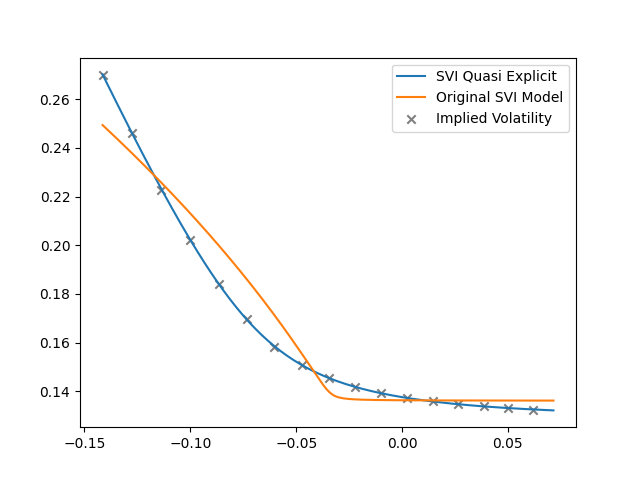
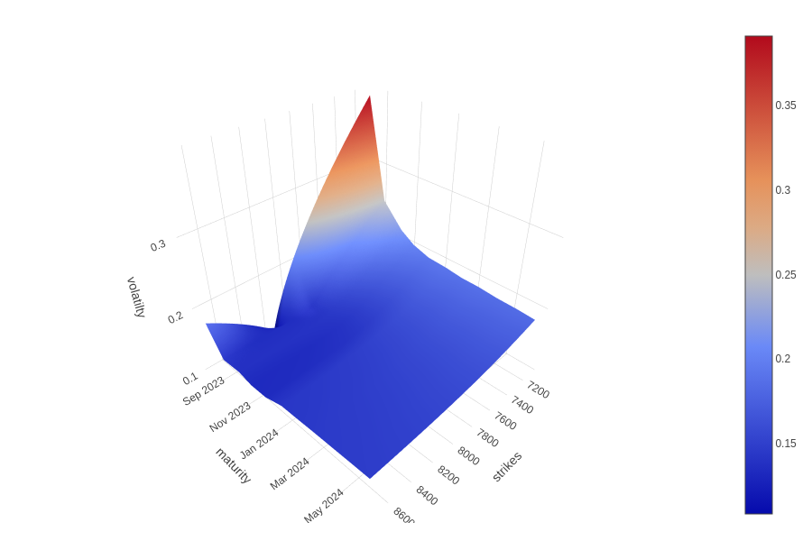
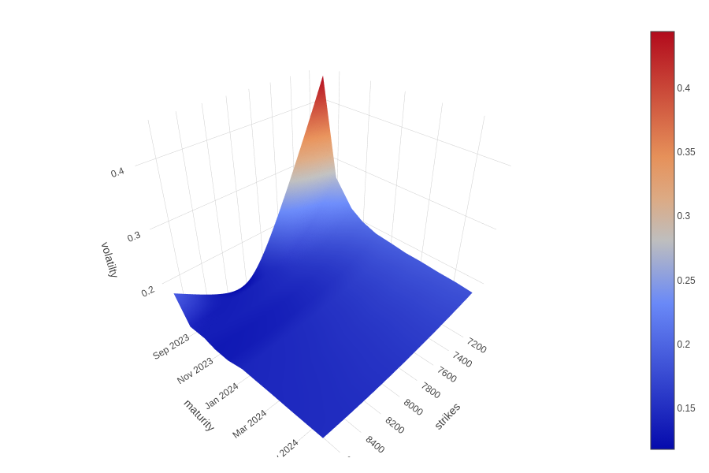

# Quasi-Explicit SVI技术文档

## SVI 模型回顾

SVI (Stochastic Volatility Inspired) 模型由 Gatheral (2004) 提出，用于描述隐含波动率的微笑形状，该模型表现形式为：

$$
\begin{equation}
	v(x) = \sigma_{BS}^2 (x) = a + b(\rho(x - m) + \sqrt{(x - m)^2 + \sigma^2})
\end{equation}
$$

其中，$x$ 是对数moneyness, 即 $ \log(\frac{K}{F_T})$ ， $K$ 为行权价， $F_T$ 为到期时的标的资产的远期价格。SVI模型中的参数控制隐含波动率曲线的形态和特点，具体如下：

- $a$ 表示隐含波动率的基准水平，调整 $a$ 的值会导致整条曲线在垂直方向上移动;
- $b$ 表示波动率微笑的振幅，即控制曲线在左右两端渐近线之间的张开角度。$b$值的增加会减少这个角度，使曲线更为收敛;
- $\rho$ 表示微笑的倾斜度，即曲线的整体倾斜，调整 $\rho$ 的值会产生对曲线的旋转效果;
- $m$ 定义曲线的水平中心位置，修改 $m$ 会导致曲线在水平方向上的整体移位;
- $\sigma$ 表示微笑的宽度，即决定曲线定点附近的平滑度，较大的 $\sigma$ 值会使曲线在这一区域更为平缓。

这些参数共同定义了隐含波动率的微笑形态，可以准确捕捉和再现市场上观察到的隐含波动率曲线。

## Quasi-Explicit 模型

在某些特定情况下，尤其是市场数据稀少或缺少远离moneyness的期权时，原始 SVI 模型有可能会产生无界隐含波动率或出现拟合失败的情形。为了解决这个问题，Zeliade Systems (2009) 提出 Quasi-Explicit SVI 模型。在 Quasi-Explicit 模型中，对上述 SVI 公式进行了改进，通过引入额外的到期日参数 $T$ ，使模型更加灵活，并能够提供相对稳健的参数估计值进而适应各种市场条件。

Quasi-Explicit 是SVI的另一种形式，更适合于参数校准，对参数的定义与SVI原始公式略有不同：

$$
y (x) = \frac{x - m}{\sigma}
$$

Zeliade Systems (2009) 强调波动率的总方差 $ \tilde{v} = T v$ ， 因此SVI 参数形式转换为

$$
v (x) = a T + b\sigma T (\rho y + \sqrt{y^2 + 1})
$$

此表达式清晰地展示了，对于固定的 $m$ 和 $\sigma$ 值，$Tv$ 曲线能够完全由 $a$， $\rho$ 以及 乘积 $b\sigma$  决定。因此，若重新定义参数为

$$
\begin{aligned}
	c & = b \sigma T \\
	d & = \rho b \sigma T \\
	\tilde{a} &= aT
\end{aligned}
$$

那么， $\tilde{v}(y)$ 呈线性依赖于 $c$， $d$ ， $a$ :

$$
\begin{equation}
 	\tilde{v}(y) = \tilde{a} + dy + c \sqrt{y^2 + 1}
\end{equation}
$$

### 内层优化

因此，对于固定值 $m$ 和 $\sigma$，求解问题：

$$
\begin{equation}
	(P_{m, \sigma}) \min_{(c, d, \tilde{a}) \in D} f_{y_i, v_i}(c, d, \tilde{a})
\end{equation}
$$

其中，$f{y_i, v_i}$为成本函数

$$
\begin{aligned}
    f_{y_i, vi}(c , d, \tilde{a})  &= f (c, d, \tilde{a}) = \sum_{i = 1}^n(\tilde{v}(y_i) - \tilde{v_i})^2 \\
    \tilde{v_i} &= Tv_i \\ 
\end{aligned}
$$

$(c, d, \tilde{a})$ 的定义域 $D$ 为

$$
D = 
\begin{cases}
	0 \leq c \leq 5\sigma \\
	\mid d \mid \leq c \space\text{and}\space \mid d \mid \leq 4\sigma -c \\
	0 \leq \tilde{a} \leq \max_i(\tilde{v_i})
\end{cases}
$$

### 外层优化

设 $(c^*, d^*, \tilde{a}^*)$ 代表 $P_{m,\sigma}$的解，并且 $(a^*, b^*, \rho ^*)$ 为对应三元组 $(a, b, \rho)$， 那么完整的模型校准问题可表示为

$$
\begin{equation}
	(P) \space \space \min_{m, \sigma} \sum_{i = 1}{n}(v_{m, \sigma, a^*, b^*, \rho^*}(x_i) - v_i^2)
\end{equation}
$$

到这一步骤之后，剩下的唯一任务即为求解二维方程 $P_{m, \sigma}$ 。

#### 降维问题的闭式解

$P_{m, \sigma}$ 是一个有着线性规划的凸优化问题，在容许域 $D$ 中定义的所有约束条件均为线性的。显而易见，该方程有一个显示解。在外层优化中，由于成本函数 $f$ 是关于 $(\sigma, m)$ 的非线性函数，$f$ 会出现多个局部最小值。

针对外层优化，Zeliade Systems (2009) 推荐 Nelder-Mead Simplex (1965) 算法。在外层优化中，采用Nelder-Mead Simplex算法具有明显优势。该算法是一个无约束优化算法，能够处理非线性、非平滑的目标函数。其次，该方法不需要目标函数的导数信息，特别适用于导数难以计算或不存在的情形。另外，通过使用单纯形法的迭代搜索策略，它能够有效地搜索和收敛到函数的局部最小值。而且，Nelder-Mead 方法在多维度参数空间中表现稳健，尤其是在初值选择不是非常接近最优解的情况下，在实际外层优化问题中应用广泛  (Gao and Han, 2010)。

### 实证分析

#### 2D波动率曲线

测试数据为2023年7月26日l2309期权的隐含波动率为例，日历日到期时长为 `43.0`， 无风险利率为`0.02`。

Quasi-SVI、SVI以及隐含波动率的对比结果如下：

#### 3D波动率曲面
测试数据为2023年7月26日聚乙烯期权的隐含波动率为例，日历日到期时长为 `43.0`， 无风险利率为`0.02`。

隐含波动率曲面如下：

原始SVI波动率曲面如下：

Quasi-explicit波动率曲面如下：

## 总结

Quasi-Explicit SVI 在原始SVI的基础上，引入对到期日 $T$ 的考虑，使得模型更加稳健并能够适应市场变化。其模型校准过程中同时考虑了全局和局部优化，确保能够更准确地捕捉市场上的隐含波动率曲线。

## 参考文献 

1. Gao, F. and Han, L. (2010) 'Implementing the Nelder-Mead simplex algorithm with adaptive parameters', *Computational Optimization and Applications*, 51(1), pp. 259-277.

2. Gatheral, J. (2004) 'A parsimonious arbitrage-free implied volatility parameterization with application to the valuation of volatility derivatives', Presentation at Global Derivatives & Risk Management, Madrid.

3. Nelder, J.A. and Mead, R. (1965) 'A simplex method for function minimization', *The Computer Journal*, 7(4), pp. 308-313.

4. Zeliade Systems (2009) *Quasi-explicit calibration of Gatheral's SVI model*, Zeliade White Papers.

